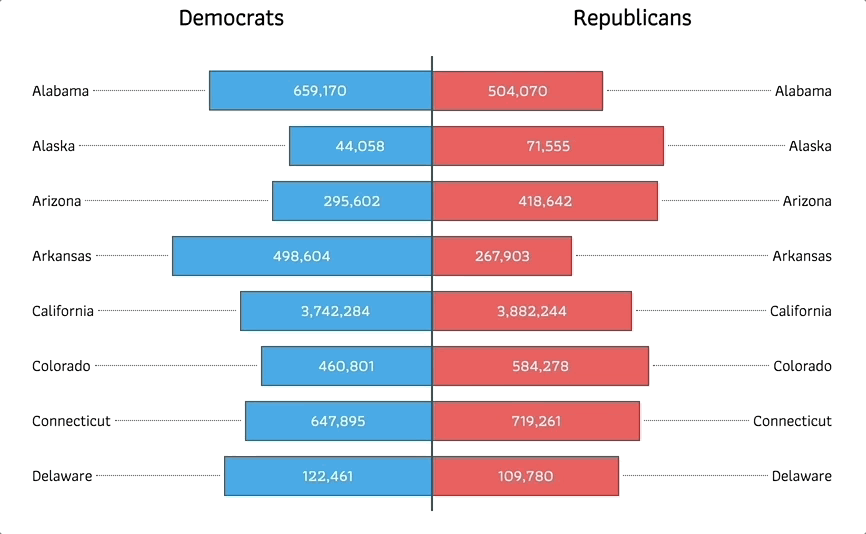

# react-butterfly-chart

React Butterfly Chart allows you to make a simple, elegant butterfly chart component. 

Butterfly Charts are best suited for comparing two groups with the same paramaters, like election results or population data.

## Demo



## Installation

```
npm install react-butterfly-chart
```

## Example use

```
<ButterflyChart
    titleLeft="Democrats"
    titleRight="Republicans"
    leftData={leftElectionData}
    rightData={rightElectionData}
    labelField="state"
    dataField="candidatevotes"
    leftColor="#2AA1EC" 
    rightColor="#FE6A59"
/>
```

## Props
 * ```titleLeft``` - title that appears on the left side of the chart
 * ```titleRight``` - title that appears on the right side of the chart
 * ```leftData``` - data that appears on the left side of the chart
 * ```rightData``` - data that appears on the left side of the chart
 * ```labelField``` - field that will be used to label individual bars
 * ```dataField``` - field that will be used to label individual bars
 * ```leftColor``` - hexcolor for left bars
 * ```rightcolor``` - hexcolor for right bars
   
Data should be provided as an object in "row" format and **always include a ```percentage``` field** that the component will use to determine the width of the bar. ```percentage``` field should be provided as an integer. ```label``` and ```data``` fields should be passed in the format that you want displayed. For example: 
```
data = {
    "0":{
        "group": "81-100", 
        "population": "30M",
        "percentage": "40",
    },
    "1":{
        "group": "41-60", 
        "population": "45M",
        "percentage": "30",
    }
}
```
Take care to provide an equal number of rows to each side.  

## License

This project is licensed under the MIT License.